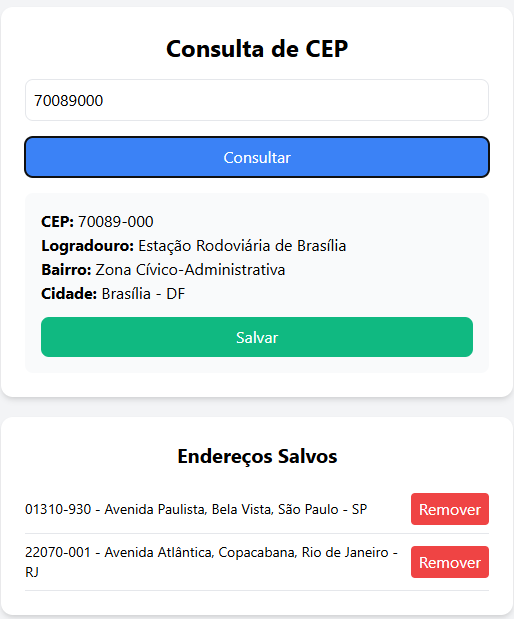

# Aplicativo React com API do ViaCEP

## Tecnologias Utilizadas

React 
TypeScript 
TailwindCSS 
useState 

## Como Testar

### Execute o comando abaixo na pasta do projeto:

### `npm start`

### Executa o aplicativo no modo de desenvolvimento.

Abra [http://localhost:3000](http://localhost:3000) para visualizá-lo no navegador.

### Obs: No arquivo package.json, configurei os comandos npm install, npm run build e npm start para rodarem juntos na linha: "start": "npm install && react-scripts build && react-scripts start". Porém, se houver problema de execução, remova o "npm install && react-scripts build" e deixe apenas o react-scripts start, que é o padrão. Em seguida, execute os comandos separadamente na seguinte ordem: 1. npm install, 2. npm run build, 3. npm start.